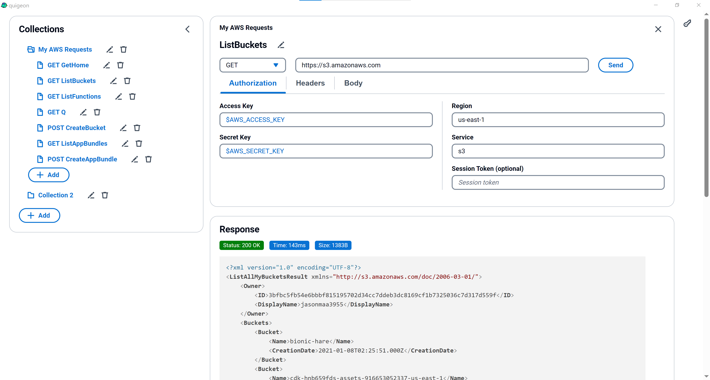

# Quigeon

A desktop app for querying AWS inspired by
[awscurl](https://github.com/okigan/awscurl) and
[Postman](https://www.postman.com/).



## Getting Started

Create `.env.local` from `sample.env.local`.

Set a secret value for secret value in `VITE_PUBLIC_ENCRYPTION_KEY_SECRETS`. For
example:

```json
[
  {
    "version": "1",
    "method": "aws_AES256_GCM_IV12_TAG16_NO_PADDING",
    "secretValue": "myKeySecret"
  }
]
```

Run development app:

```
yarn install
yarn tauri dev
```